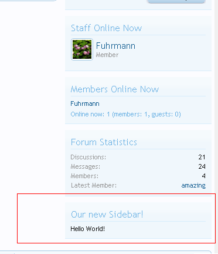
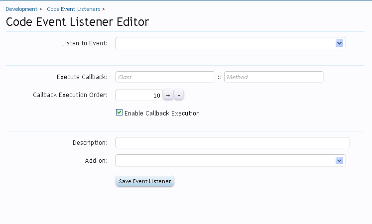
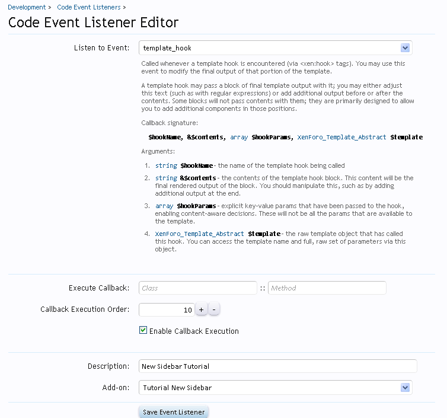
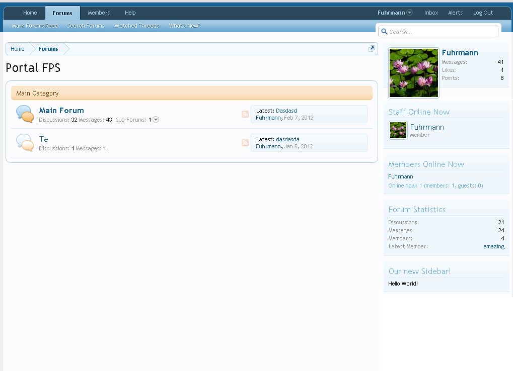

### How to add a new sidebar in the forum list
###### 2012-02-15 17:11

I will teach you to add a new sidebar with a custom content in the forum list page.

This is the final result:



<!--more-->

This tutorial consists in 4 steps:

- [Step 1 - Creating the Add-on](#step_1__creating_the_addon)
- [Step 2 - The template](#step_2__the_template)
- [Step 3 - Where do I insert the sidebar?](#step_3__where_do_i_insert_the_sidebar)
- [Step 4 - The listener](#step_4__the_listener)


### <a name="step_1__creating_the_addon"></a>Step 1 - Creating the Add-on

First we need to create a new add-on. This is a very simple step. To be able to create you need to be in Debug Mode. You can see how to put your forum in Debug Mode in this [link](http://xenforo.com/community/threads/frequently-asked-questions.5183/#post-248490).

To create a new add-on go to **AdminCP -> Home -> List Add-ons** and click in the button **Create Add-on**. In the following screen you need to fill those fields to create the add-on. Use the info below:

- **Add-on ID**: NewSidebar
- **Title**: Tutorial New Sidebar
- **Add-on is active**: Checked
- **Version String**: 1.0.0
- **Version ID**: 1

And the rest of the fields just let in blank. We do not need to fill. This add-on is just simple add-on, so we dont have any installation process or something. Click Save Add-on and your add-on is created!

Before continue, let's create our folder and the necessary file. Go to `your_xenforo_root/library` and create a new folder naming it to `NewSidebar`. Inside this new created folder, create a file called: `Listener.php`.

### <a name="step_2__the_template"></a>Step 2 - The template

We need now to create the template that will hold our content to be shown in the sidebar. You can put whatever you want in the template, but for this tutorial we'll just output a simple text "Hello World". To create a new template (will be used in our new sidebar) go to **AdminCP -> Appearance -> Templates** and hit the **+Create new Template** button.

You can copy and paste in the template editor the following code:

**Template name**: *newsidebar_sidebar*

```html
<div class="section">
    <div class="secondaryContent">
        <div class="visitorText">
            <h3>Our new Sidebar!</h3>
            <div class="stats">
                Hello World!
            </div>
        </div>
    </div>
</div>
```

Save. Done, our template is ready to be used in the sidebar.

### <a name="step_3__where_do_i_insert_the_sidebar"></a>Step 3 - Where do I insert the sidebar?

XenForo works with template hooks. If you are not familiar with this system, take a look at this [video tutorial made by Kier](http://xenforo.com/community/threads/how-to-use-template-hooks.13167/).

After seeing the video, you are now familiar with the system (I guess!). So, we need to find which hook we will use to insert our sidebar right after the default XenForo sidebar in the forum list page.

Do to that, we need to take a look at the template **forum_list**, which is the template of the forum list page. You can search for it going to **AdminCP -> Appearance -> Search Templates** and in the box **Title Contains** fill with this: *forum_list* and search.

You'll be presented with only one result, which is the template we're looking for. Open the template and take a look at the code. Se if you find any template hooks.

(take your time)

....


Ok! Found? I've found what we want:

```html
<xen:hook name="forum_list_sidebar">
```

See...this is the hook right before the forum list sidebar starts. So, we will use an event listener to insert some custom content in there. Please, take a note of the hook name (in bold) we will use it later.

You can write down in your notepad or something or just consult back this tutorial.

### <a name="step_4__the_listener"></a>Step 4 - The listener

To create a new code event listener go to **AdminCP -> Development -> Code Event Listeners** and hit the **+Create New Code Event Listener** button and you will get this:



Fill with the following information:

- **Listen to event**: template_hook
- **Execute CallBack**: do not fill anything, we'll create one
- **Callback Execution Order**: 10
- **Enable Callback Execution**: checked
- **Description**: New Sidebar Tutorial
- **Add-on**: Tutorial New Sidebar

Try to save! You'll get an error, right? That's because we do not have created our callback class and method to use in the event listener.

Leave the Code Event Listener page **OPEN** and let's create our callback class.

Remember in the begining of this tutorial that we've create a folder and a file? So, you have to go there and open the `Listener.php` file.

If you don't remember it is in: `xenforo_root/library/NewSidebar`. File opened, paste the following code:

```php
<?php
/**
* This is our callback class.
* We must define a callback class to be used in the code event listener.
*/
class NewSidebar_Listener
{
    /**
    * This is our callback method. It uses 4 params. This method will check if the current requested hook is what we want ('forum_list_sidebar')
    * and if it is, we will insert in the contents our template. This way we will have a sidebar right after the XenForo default sidebar.
    *
    */
    public static function templateHook($hookName, &$contents, array $hookParams, XenForo_Template_Abstract $template)
    {
        /* If this hook is what we want! Remember: we have found the hook name when we was looking in the forum_list template! */
        if ($hookName == 'forum_list_sidebar')
        {
            /* Insert our template in the contents. This way our sidebar will be inserted right after the last XenForo sidebar in the forum list page */
            $contents .= $template->create('newsidebar_sidebar');

            /* If you want that our sidebar be BEFORE the XenForo sidebars uncomment the following line (don't forget to comment the line above) */
            //$contents = $template->create('newsidebar_sidebar') . $contents;
        }
    }
}
?>
```

> (please, take a look at the comments, all code is explained in there, it is important to you know what you are doing)

Ok. We have now our callback class and callback method:

```php
NewSidebar_Listener::templateHook
```

Go back to the page where you were before. The code event listeners page. If you have let the page opened you will may have this:



So, now, fill the Execute Callback with the information you've got:

- **Class**: NewSidebar_Listener
- **Method**: templateHook

Save it! (no errors should appear now!)

Go now to your forum list page when your result will be this:


