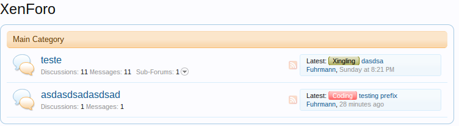
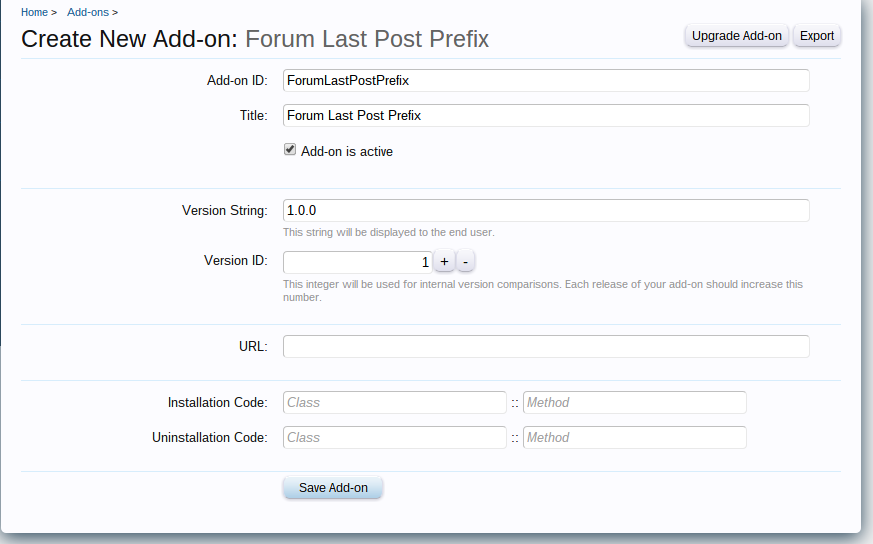
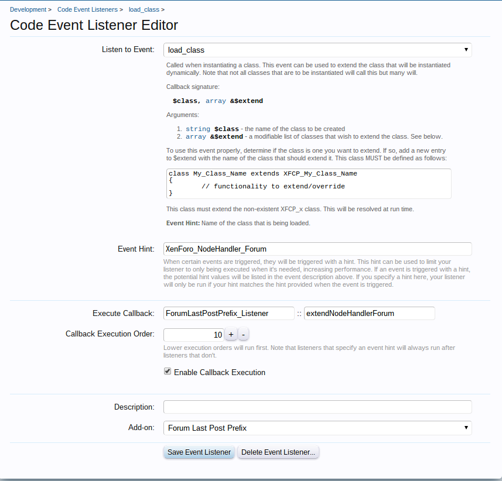
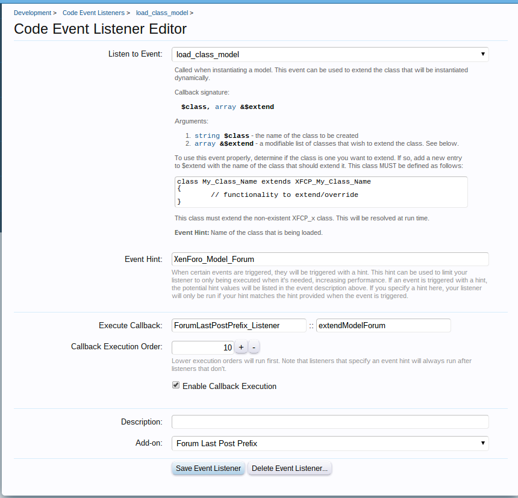
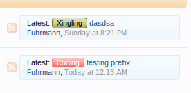
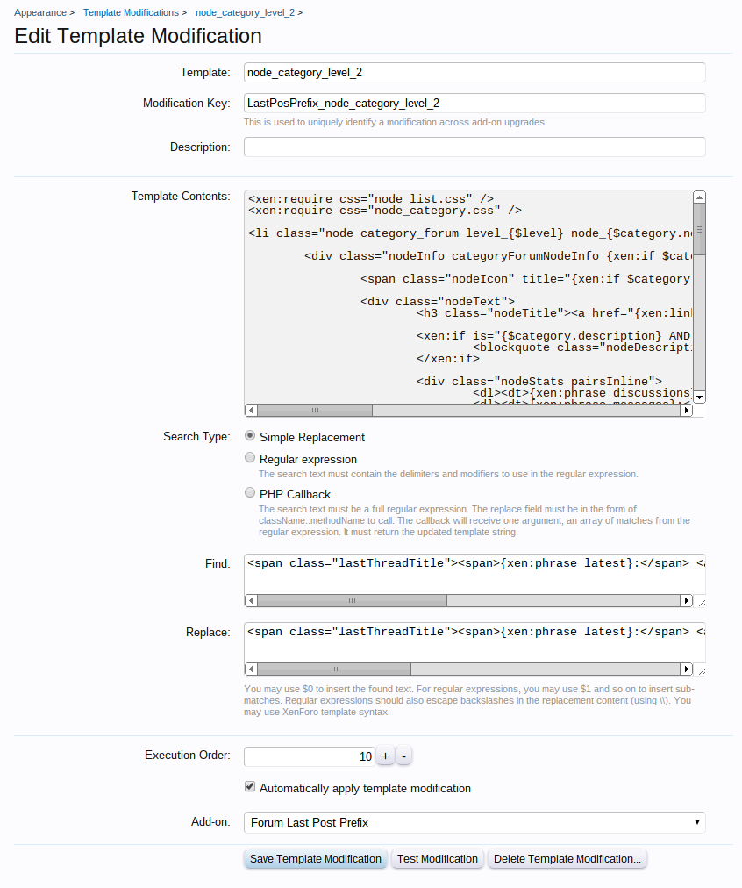
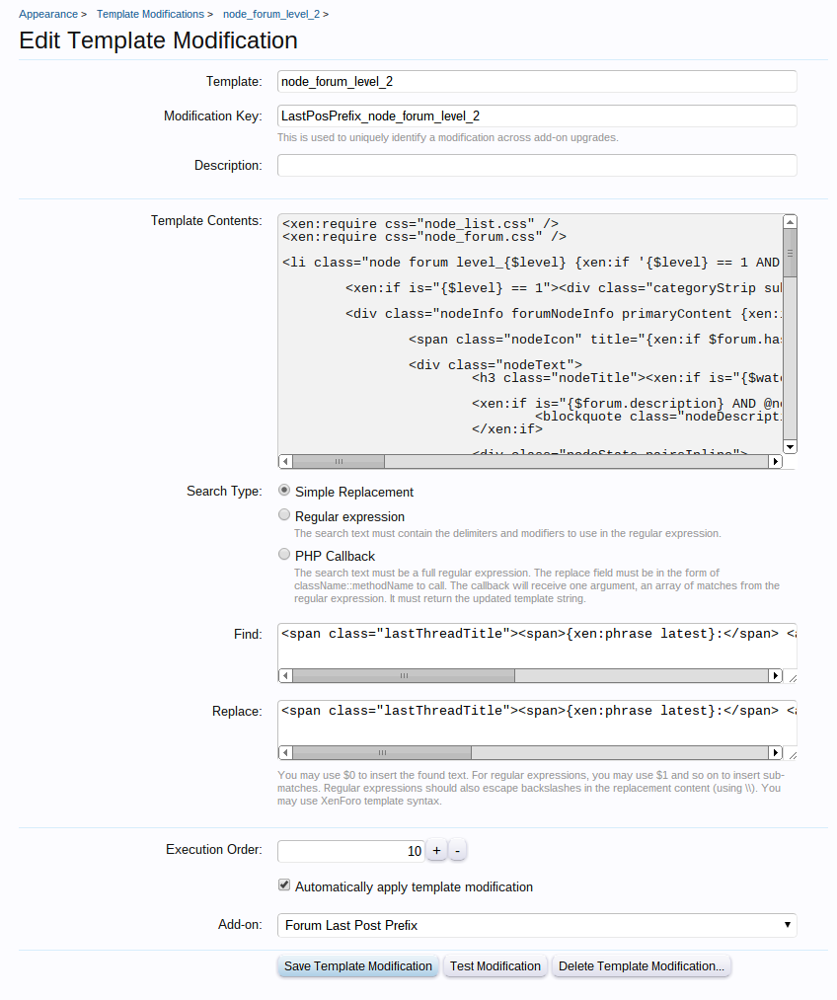
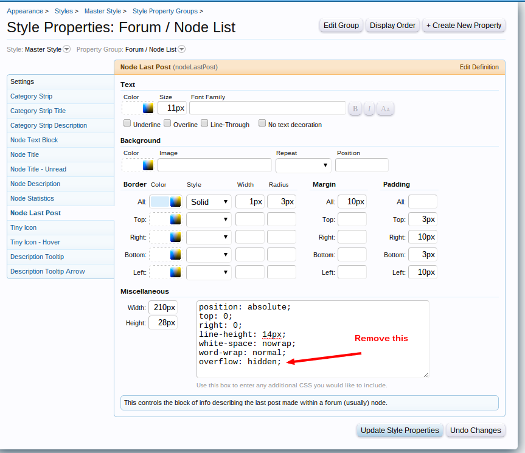

### How to add the last post prefix to forum list
###### 2014-02-25 20:35

In this tutorial I will show you how to add the prefix of the last post onto the forum list, as per this image:



## Steps

This tutorial consists of 5, easy to follow steps:

- [Step 1 - Creating the Add-on](#step_1__creating_the_addon)
- [Step 2 - Understanding what we'll do](#step_2__understanding_what_we_ll_do)
- [Step 3 - Creating the Listener](#step_3__creating_the_listener)
- [Step 4 - Creating the classes](#step_4__creating_the_classes)
- [Step 5 - Creating the Template Modifications](#step_5__creating_the_template_modifications)

### <a name="step_1__creating_the_addon"></a>Step 1 - Creating the Add-on

Let's start by creating a new add-on. This is easy enough to do, but first you need to enable Debug Mode. To do this, simply open up your *library/config.php* file, and add `$config['debug'] = true;` to it.

Now to create a new add-on, go to **AdminCP -> Home -> List Add-ons** and click on **Create Add-on**. Here, fill out the fields as follows:

- **Add-on ID**: ForumLastPostPrefix
- **Title**: Forum Last Post Prefix
- **Add-on is active**: Checked
- **Version String**: 1.0.0
- **Version ID**: 1

Leave the rest of the fields blank. This is what you should end up with:



Click Save Add-on and your add-on is created!

### <a name="step_2__understanding_what_we_ll_do"></a>Step 2 - Understanding what we'll do

In the `xf_forum` table, we have the following columns:

`last_post_id` => The ID of the last post in that forum
`last_post_date` => The date of the last post in that forum
`last_post_user_id` => The ID of the last user who posted in that forum
`last_post_username` => The username of the user who posted in that forum
`last_thread_title` => The title of the last thread of that forum

That's it. No more columns related to 'last' something in forums. So, how do we gonna take the prefix of the last post? That's pretty simple.
The prefix information that we want is in another table called `xf_thread`. It is there where all the threads records are, including the `prefix_id` of each thread. This means that we will have, in someway to get info from this table. But how?

Everytime we visit the forum list, XenForo calls a function called `getExtraDataForNodes`, that gets the extra, node-type-specified data for the list of nodes. In this case, the node is a forum. This function is at the following path: `xenforo_root/library/XenForo/NodeHandler/Forum.php`, line 80. Take a look:

```php
public function getExtraDataForNodes(array $nodeIds)
{
    $userId = XenForo_Visitor::getUserId(); // TODO: ideally this should be passed in
    $forumFetchOptions = array('readUserId' => $userId);

    return $this->_getForumModel()->getExtraForumDataForNodes($nodeIds, $forumFetchOptions);
}
```

In the very last line of the function, we have a call to another function called `getExtraForumDataForNodes`! This function is inside the forum model, as we can see. The forum model is at the following path: `xenforo_root/library/XenForo/Model/Forum.php` and the contents of the function is:

```php
public function getExtraForumDataForNodes(array $nodeIds, array $fetchOptions = array())
{
    if (!$nodeIds)
    {
        return array();
    }

    $joinOptions = $this->prepareForumJoinOptions($fetchOptions);

    return $this->fetchAllKeyed('
        SELECT forum.*
            ' . $joinOptions['selectFields'] . '
        FROM xf_forum AS forum
        INNER JOIN xf_node AS node ON (node.node_id = forum.node_id)
        ' . $joinOptions['joinTables'] . '
        WHERE forum.node_id IN (' . $this->_getDb()->quote($nodeIds) . ')
    ', 'node_id');
}
```

What it does? 'Gets the extra data that applies to the specified forum nodes.'. If you look closer, there is another (!) function called `prepareForumJoinOptions`. This function prepare some MySql joins to get extra information from another tables...

Wait a moment...

...there it is! We can use this function to get information from the `xf_thread` table! Because it is in this table that it is recorded the `prefix_id` column!

But the function `prepareForumJoinOptions` does not join the `xf_thread`, so we have to do this for ourselves.

After all, we can conclude this:

- We have to 'overwrite' two functions. I mean 'overwrite' because we will actually add some new content to the functions.
- The functions are `getExtraDataForNodes` and `prepareForumJoinOptions`.
- To do this we need to create Listeners. It's a fact. The listeners will extend the classes and we will be able to write our own functions.

The idea is this: we have the last_post_id inside xf_forum table. So let's join the post table where the post_id is equal to the last_post_id. Having the post info, we have the thread_id of that post. Having the thread_id, we will join the xf_thread table where thread_id is equal to the post.thread_id. After that, we'll have the prefix_id.


### <a name="step_3__creating_the_listener"></a>Step 3 - Creating the Listener

Let's create our folder and the `Listener.php` file. Go to `your_xenforo_root/library` and create a folder naming it to `ForumLastPostPrefix`.
Inside this new created folder, create a file called: `Listener.php` and put the following contents:

```php
/**
 * This is the Listener. It will extend the classes below.
 */
class ForumLastPostPrefix_Listener
{
    /**
     * Extend the XenForo_NodeHandler_Forum class.
     */
    public static function extendNodeHandlerForum($class, array &$extend)
    {
        // This is the name of our class. The path to this file will be:
        // ForumLastPostPrefix/Extend/NodeHandler/Forum
        $extend[] = 'ForumLastPostPrefix_Extend_NodeHandler_Forum';
    }

    /**
     * Extend the XenForo_Model_Forum class
     */
    public static function extendModelForum($class, array &$extend)
    {
        // This is the name of our class. The path to this file will be:
        // ForumLastPostPrefix/Extend/Model/Forum
        $extend[] = 'ForumLastPostPrefix_Extend_Model_Forum';
    }
}
```

To the Listeners work, we have to create the Code Event Listeners. Go the **AdminCP -> Development -> Code Event Listeners**. Click in **+Create new Code Event Listener** and fill with the following data:

- **Listen to event**: load_class
- **Event Hint**: XenForo_NodeHandler_Forum
- **Execute Callback**:
    - **Class**: ForumLastPostPrefix_Listener
    - **Method**: extendNodeHandlerForum
- **Add-on**: Forum Last Post Prefix

With this code event, we are saying that our Listener should call the method `extendNodeHandlerForum` every time the `XenForo_NodeHandler_Forum` class is instantiated and extend with our class.

Now, another code event listener:

- **Listen to event**: load_class_model
- **Event Hint**: XenForo_Model_Forum
- **Execute Callback**:
    - **Class**: ForumLastPostPrefix_Listener
    - **Method**: extendModelForum
- **Add-on**: Forum Last Post Prefix

With this code event, we are saying that our Listener should call the method `extendModelForum` every time the `XenForo_Model_Forum` class is instantiated, and extend with our class. This is the results from both code events:






### <a name="step_4__creating_the_classes"></a>Step 4 - Creating the classes


To know where you need to create your classes is very easy, just see inside the Listener.php file that we are using the following classes to extend the XenForo core classes:

`ForumLastPostPrefix_Extend_NodeHandler_Forum`
`ForumLastPostPrefix_Extend_Model_Forum`


So for the first file `ForumLastPostPrefix_Extend_NodeHandler_Forum` you can follow this path:

|-xenforo_root
|---library
|------ForumLastPostPrefix
|--------- Extend (**new folder**)
|------------ NodeHandler (**new folder**)
|---------------- Forum.php (**new file**)


In the new file, put the contents below (don't forget to open the php tag):

```php
class ForumLastPostPrefix_Extend_NodeHandler_Forum extends XFCP_ForumLastPostPrefix_Extend_NodeHandler_Forum
{
    // Remember above this same function? Now we are overwriting it to add a custom
    // join option
    public function getExtraDataForNodes(array $nodeIds)
    {
        $userId = XenForo_Visitor::getUserId(); // TODO: ideally this should be passed in
        $forumFetchOptions = array(
            'readUserId' => $userId,
            /* Below we say: 'do a join to the post table, and then to the xf_thread table and return
             * back the prefix_id'. This may appear more simple then that, but actually the whole interpretation
             * is inside the Forum Model. Here we just pass an option so later we can identify what we
             * want to join. */
            'last_post' => true
        );

        // Return the nodes with the forumFetchOptions we customized!
        return $this->_getForumModel()->getExtraForumDataForNodes($nodeIds, $forumFetchOptions);
    }
}
```

Now we will create the ForumLastPostPrefix_Extend_Model_Forum. You can follow this path:

|-xenforo_root
|---library
|------ForumLastPostPrefix
|--------- Extend
|------------ Model (**new folder**)
|---------------- Forum.php (**new file**)

In the new file, put the contents below (don't forget to open the php tag):

```php
class ForumLastPostPrefix_Extend_Model_Forum extends XFCP_ForumLastPostPrefix_Extend_Model_Forum
{
    /*
     * This is the same function of XenForo. But since here we don't want to overwrite, we will
     * call the parent first, get the contents and then later apply our join to another table.
     */

    public function prepareForumJoinOptions(array $fetchOptions)
    {
        /* The line below return an array with two keys: 'selectFields' and 'joinTables'.
         * One of them means: "which fields should I select to this forum?" The another means:
         * "Which tables should I join to get some extra data to this forum?"
         */
        $parent = parent::prepareForumJoinOptions($fetchOptions);

        // If we set that we want to fetch last_post info...
        if (isset($fetchOptions['last_post'])) {
            $parent['selectFields'] .= ', post.thread_id, thread.prefix_id ';
            $parent['joinTables'] .= ' INNER JOIN xf_post AS post ON (forum.last_post_id = post.post_id) INNER JOIN xf_thread AS thread ON (thread.thread_id = post.thread_id)';
        }

        return $parent;
    }
}
```

To explain better the function above:

- We get the selected fields and append some more: post.thread_id and thread.prefix_id;
- Then we append two new JOINS: with the post table and with the thread table. 'But why?', you may ask. That's because the `xf_forum` table have the `last_post_id`. With the last post id, we can the post. With the post, we can get the thread. And with the thread we can get the `prefix_id` of the last post of that forum.


### <a name="step_5__creating_the_template_modifications"></a>Step 5 - Creating the Template Modifications

As we want to append the thread prefix into the forum list, we have to do some template modifications. Only 2. We want to find this:


And turn into this:



To find which template is that, you can open the Chrome DevTools, inspect the classes arround and search in the AdminCP -> Search Templates section. But I'll just throw here the two templates names we have to modify:

`node_category_level_2`
`node_forum_level_2`

To create a template modification, go to **AdminCP -> Appearance -> Template Modifications** and click in the **+Create Template Modification** button. In the following screen, fill with the following data:

- **Template**: node_category_level_2
- **Modification Key**: LastPosPrefix_node_category_level_2
- **Search Type**: Simple Replacement
- **Find**:
```html
<span class="lastThreadTitle"><span>{xen:phrase latest}:</span> <a href="{xen:link posts, $category.lastPost}" title="{$category.lastPost.title}">
```
- **Replace**:
```html
<span class="lastThreadTitle"><span>{xen:phrase latest}:</span> <a href="{xen:link posts, $category.lastPost}" title="{$category.lastPost.title}"> {xen:helper threadPrefix, $forum}
```
- **Add-on**: Forum Last Post Prefix

Save!




Then, create another template modification:

- **Template**: node_forum_level_2
- **Modification Key**: LastPosPrefix_node_forum_level_2
- **Search Type**: Simple Replacement
- **Find**:
```html
<span class="lastThreadTitle"><span>{xen:phrase latest}:</span> <a href="{xen:link posts, $forum.lastPost}" title="{$forum.lastPost.title}">
```
- **Replace**:
```html
<span class="lastThreadTitle"><span>{xen:phrase latest}:</span> <a href="{xen:link posts, $forum.lastPost}" title="{$forum.lastPost.title}"> {xen:helper threadPrefix, $forum}
```
- **Add-on**: Forum Last Post Prefix

Save!



Now go to your forum list and you'll have the prefix of the each last post of each forum.


Tip: If are having problem with the prefix cutting off, go to **AdminCP -> Appearance -> Style Properties, choose Forum/Node List, Node Last Post and remove this, on the textarea:

```html
overflow: hidden;
```



That's it!

