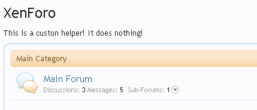

### How to create your own helpers
###### 2011-11-23 09:10

Helpers provide extra functions that you can use inside the XenForo templates.

Currently there are many Helpers, following some them:

- **avatar**: Helper to fetch the URL of a user's avatar.
- **username**: Produces a username snippet.
- **usertitle**: Helper to get the user title for the specified user.
- **richusername**: Outputs the necessary HTML for a rich username (includes the display style markup class).
- **ismemberof**: Check if the user is member of a group.
- **wordtrim**: Word trims and HTML escapes the given string.
- **autolink**: Auto-links URLs in plain text. This text should generally already be HTML escaped, because it can't be done after the linking.

You can call a helper in the template this way:

```
{xen:helper NAME_OF_THE_HELPER, 'argument1', 'argument2'}
```

So, but what if we want to use a custom template helper?


### Step 1 - Begin

As usual let's starting by creating the folder for our add-on, and including a listener (because we need one). This is the final structure:

```
forumroot
|--library
|---SimpleHelper -> Our new folder!
|-----Listener.php -> Our new file!
|---XenForo
```


Ok, once created, open the file Listener.php and add the following code:

```php
<?php

//Our class name
class SimpleHelper_Listener
{
    /**
    * Listen to the "init_dependencies" code event.
    *
    * @param XenForo_Dependencies_Abstract $dependencies
    * @param array $data
    */
    public static function init(XenForo_Dependencies_Abstract $dependencies, array $data)
    {
        //Get the static variable $helperCallbacks and add a new item in the array.
        XenForo_Template_Helper_Core::$helperCallbacks += array(
            'echo' => array('SimpleHelper_Helpers', 'helperEcho')
        );
    }
}
?>
```

**What it does?**
This function listen to the Code Event Listener init_dependecies. This code event is called when the dependency manager loads its default data. Is fired on virtually every page and is the first thing you can plug into.

The following code get the static $helperCallbacks which has the list of helpers, and merge a new one, the our simple helper.

```php
XenForo_Template_Helper_Core::$helperCallbacks += array(
    'echo' => array('SimpleHelper_Helpers', 'helperEcho')
);
```

Notice that the **SimpleHelper_Helpers** do not exists. We'll creating this class in the next step.

We now need to do two things: create a new add-on and create a new event listener in the **AdminCP**.

#### Create the add-on

To create a new add-on, go to **AdminCP -> Development -> Create Add-on** and fill with the info:

- **Add-on ID**: SimpleHelper
- **Title**: Simple Helper
- **Version String**: 1.0.0
- **Version ID**: 1

Then save it.

#### Create the Event Listener

Go to **AdminCP -> Development -> Code Event Listeners** and create a new listener using our function.

- **Listen to Event**: init_dependecies
- **Execute Callback Class**: SimpleHelper_Listener
- **Execute Callback method**: init
- **Description**: Add a new custom helper
- **Add-on**: Simple helper

Save it!

### Step 2 - Core

Now that are all setup, let's create the function that will handle the call to the helper echo.

Create one more file:

```
forumroot
|--library
|---SimpleHelper
|-----Helpers.php -> Our new file!
|-----Listener.php
|---XenForo
```

Open the new file `SimpleHelper/Helpers.php` and put the following code:

```php
<?php
//Our class helper (we can put any helpers in here we want)
class SimpleHelper_Helpers
{
    public static function helperEcho ($string)
    {
        //We only return the argument, dont do nothing.
        return $string;
    }
}
?>
```

Remember this piece of code in the `Listener.php`:

```php
'echo' => array('SimpleHelper_Helpers', 'helperEcho')
```

So, we just have created a class `SimpleHelper_Helpers` and a function `helperEcho`. But as you can see, this helper does nothing! It just take an argument (the first one) and then return as it is.


### Step 3 - Testing

Let's test this.

Open the template `forum_view` and put this at the top:

```
{xen:helper echo, 'This is a custon helper! It does nothing!'}
```

Save.

Go to your forum list, refresh the page and you'll see something like this:



Ok, it works, but how we can make this helper a little more.....helpish?


### Step 4 - More functionality


Let's change what this helper do. Open the file `SimpleHelper/Helpers.php` and change our `helperEcho` to the following code:

```php
public static function helperEcho ($string, $color)
{
    return "<font color=$color>$string</font>";
}
```

Open the `forum_list` and change the call to this helper to:

```
{xen:helper echo, 'This is a custon helper! It does nothing!', 'red'}
```

Refresh the forum list in your forum and see what happens. It will turn all the text red.

So that's it. You can create your own helpers this way. And for sure, you can do a lot more then just echo a string in the red color.
