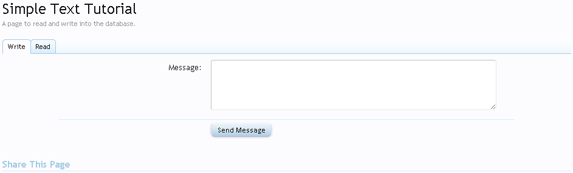
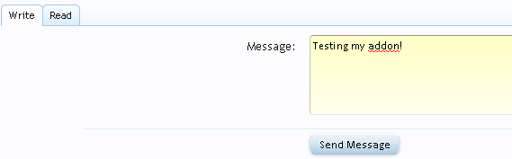

### How to read and write into the database (with a page)
###### 2011-11-21 19:13

I'll teach how to read and write to the database using XenForo. This tutorial can be found also [here](http://xenforo.com/community/resources/how-to-read-and-write-into-the-database-with-a-page.328/).

<!--more-->

## Steps

This tutorial consists in 11 steps:

- [Step 1 - Setting the table](#step_1__setting_the_table)
- [Step 2 - Creating the installer](#step_2__creating_the_installer)
- [Step 3 - Installer.php](#step_3__installerphp)
- [Step 4 - The Model](#step_4__the_model)
- [Step 5 - The DataWriter](#step_5__the_datawriter)
- [Step 6 - The Controller](#step_6__the_controller)
- [Step 7 - The Route](#step_7__the_route)
- [Step 8 - AdminCP](#step_8__admincp)
- [Step 9 - The template](#step_9__the_template)
- [Step 10 - The Page](#step_10__the_page)
- [Step 11 - The Final](#step_11__the_final)

### <a name="step_1__setting_the_table"></a>Step 1 - Setting the table

To start we must know what are the fields that we use to read/write in the database. That is, the fields that will store the information we want to read later.

I'll start setting the table name, fields and types of each:

- Table:
**xf_simple_text**

- Fields:<br>
---- **simple_id**: The autoincrement field of each row.<br>
---- **simple_text**: This is the field that will contain our written text. Type: varchar; Lenght: 200;<br>
---- **simple_date**: This is the date when we write the text. Type: INT; Lenght: 10;<br>


####XenTips
> - Whenever you need to create a table in the database, follow a pattern. Put the name of your add-on along with the prefix of the other tables in your XenForo.
> - The more precise you define the types of each field in your table, the better the performance.


### <a name="step_2__creating_the_installer"></a>Step 2 - Creating the installer

When creating an add-on for XenForo you should follow a standard structure, both in the creation of folders such as the naming of the classes.

All files in our add-on should be created in the folder `forumroot/library/`. This folder will also contain all other add-ons you have installed on your forum.

First of all, let's create a folder for our add-on. "But where?" You must be wondering. Inside the folder `forumroot/library/`. So start by creating a folder with the name of our add-on: **SimpleText**.

This is the skeleton of the folder (note that I'm just listing the folder XenForo for reference):

```
forumroot
|--library
|----SimpleText -> our new folder!
|----XenForo
```

Now that we've created the folder, we must create a file called `Installer.php` that will contain two methods: `install()` that creates the table and `uninstall()` it will delete this table (when you uninstall).

```
forumroot
|--library
|---SimpleText
|-----Installer.php -> Our new file!
|---XenForo
```

We have our first folder and file in PHP. But what do we do with it? See the next step.

#### We all have dumb questions

> **Q.** Why use the name Installer? And why create this file? What's the use?<br>
> **A.** The Installer.php will be our installation file for our add-on. You can put whatever you want. "Installme.php", "MyFileInstall.php" or previously "ThisFileDoNotHaveAName.php" (not recommended). But for better understanding, simply use "Installer.php", so we know what it is about this file. By creating an add-on, we have the option of selecting a class for installation (and method) and a class to uninstall (and method). So every time someone install/uninstall your add-on, this class / method is called. As this simple add-on uses a table in the database to record and read the data, we will use this property of the add-on to tell XenForo that: "XenForo when installing my add-on please find a class and call the method SimpleText_Installer::install(), ok?"

### <a name="step_3__installerphp"></a>Step 3 - Installer.php

`Installer.php` within the file will have two functions: `install()` and `uninstall()`. Respectively, the two will be used to install and uninstall our add-on.
So, open the file `Installer.php` and we will begin to develop by creating a class:

```php
<?php
class SimpleText_Installer
{
}
?>
```

Note that we use another pattern we should follow: `SimpleText_Installer`. That says something to you?

Yes! Take a look:

- **SimpleText**: The name of our directory.
- **Installer**: The name of our file.

Therefore, we will always follow this pattern. If we had a structure like this:

    library
    |---SimpleText -> folder
    |----Installer -> folder
    |-----Installer.php -> file
    |---XenForo


How would the class name of our file `Installer.php`?

> Answer: `SimpleText_Installer_Installer`


Look:

- **SimpleText**: Folder!
- **Installer**: Folder!
- **Installer**: File!


So I always follow this structure. Over the next file you will get more used to it.

Back to our installation file, we will now create a variable that will contain the definitions of our table, along with the fields you want to create and the types of each. For this, we create a variable called `$table`. This variable holds a `SQL CREATE` command who will be responsible for creating the table in our database.

```php
protected static $table = array(
    'createQuery' => 'CREATE TABLE IF NOT EXISTS `xf_simple_text` (
                `simple_id` INT( 10 ) NOT NULL AUTO_INCREMENT,
                `simple_text` VARCHAR ( 200 ),
                `simple_date` INT( 10 ) UNSIGNED,
                PRIMARY KEY (`simple_id`)
                )
            ENGINE = InnoDB CHARACTER SET utf8 COLLATE utf8_general_ci;',
    'dropQuery' => 'DROP TABLE IF EXISTS `xf_simple_text`'
);
```


You may notice that the variable `$table` is actually an array with two keys:

- **createQuery**: SQL command to create the table.
- **dropQuery**: SQL command to delete the table.

Let's dissect the key createQuery SQL command:

- `CREATE TABLE IF NOT EXISTS` - Create the table if it does not exist. If it exists, skip this step and proceed to the next (if any). For details of the condition `IF NOT EXISTS`, [click here](http://dev.mysql.com/doc/refman/5.1/en/create-table.html).

- `xf_simple_text` - This is the name of the table we want to create the database.

- `simple_id INT ( 10 )` - The autoincrement field of this table.

- `simple_text VARCHAR ( 200 )` - First we'll create the field is called 'simple_text'. The field that will store the text we have written and then saved in the table. The type it is [VARCHAR](http://dev.mysql.com/doc/refman/5.1/en/char.html) and the lenght is 200.

- `simple_date INT UNSIGNED ( 10 )` - This field will store the date you sent the text to the database. Will be changed every time you write a new text and save the table. It is the type [INT UNSIGNED](http://dev.mysql.com/doc/refman/5.0/en/numeric-types.html#id613192) the lenght is 10.

- `ENGINE = InnoDB` - We will use a Inno DB table. More information [here](http://dev.mysql.com/doc/refman/5.0/en/using-innodb-tables.html).

- `SET utf8 COLLATE utf8_general_ci` - More information [here](http://dev.mysql.com/doc/refman/5.0/en/charset-applications.html).

And the key `dropQuery` has the following command:

- `DROP TABLE IF EXISTS \'xf_simple_text\'` - This will delete the table of our database, if it exists. If not, nothing will be done. More information about the `DROP TABLE` [here](http://dev.mysql.com/doc/refman/5.5/en/drop-table.html).

Everything seen here? Ok, now we have our two queries for creating and deleting the table, we create two function that will run these two SQL statements.

#### install()

This will be our method for installing the add-on. The following code:

```php
/**
* This is the function to create a table in the database so our addon will work.
*
* @since Version 1.0.0
* @version 1.0.0
* @author Fuhrmann
*/
public static function install()
{
    $db = XenForo_Application::get('db');
    $db->query(self::$table['createQuery']);
}
```


**Explanation**:

`$db = XenForo_Application::get('db');`: We took the object from the database by putting it in the variable `$db` so we can use it and call the query to create the table. We are using the class `XenForo_Application` and `get()` method.

`$db->query(self::$table['createQuery']);`: We use the object db, which is our database, and ran the query `createQuery` which is in the array `$table`, defined earlier.


#### uninstall()

This is the method to uninstall our add-on. The following code:

```php
/**
* This is the function to DELETE the table of our addon in the database.
*
* @since Version 1.0.0
* @version 1.0.0
* @author Fuhrmann
*/
public static function uninstall()
{
    $db = XenForo_Application::get('db');
    $db->query(self::$table['dropQuery']);
}
```

As you can see, the two lines of code are almost the same method `install()`.

And this is the final code:

```php
<?php
class SimpleText_Installer
{

    protected static $table = array(
        'createQuery' => 'CREATE TABLE IF NOT EXISTS `xf_simple_text` (
                    `simple_id` INT( 10 ) NOT NULL AUTO_INCREMENT,
                    `simple_text` VARCHAR ( 200 ),
                    `simple_date` INT( 10 ) UNSIGNED ,
                    PRIMARY KEY (`simple_id`)
                    )
                ENGINE = InnoDB CHARACTER SET utf8 COLLATE utf8_general_ci;',
        'dropQuery' => 'DROP TABLE IF EXISTS `xf_simple_text`'
    );

    /**
    * This is the function to create a table in the database so our addon will work.
    *
    * @since Version 1.0.0
    * @version 1.0.0
    * @author Fuhrmann
    */
    public static function install()
    {
        $db = XenForo_Application::get('db');
        $db->query(self::$table['createQuery']);
    }


    /**
    * This is the function to DELETE the table of our addon in the database.
    *
    * @since Version 1.0.0
    * @version 1.0.0
    * @author Fuhrmann
    */
    public static function uninstall()
    {
        $db = XenForo_Application::get('db');
        $db->query(self::$table['dropQuery']);
    }
}
?>
```

#### XenTips
> If you do not remember, XenForo classes follow the pattern of the names of folders and files. Therefore, the class `XenForo_Application` is in which folder?


#### XenExercise
1. Try to guess the folder and file of the following classes:

```
Class-> XenForo_ControllerHelper_CacheRebuild
Folders-> ??
File-> ??

Class-> XenForo_DataWriter_Discussion_Thread
Folders-> ??
File-> ??

Class-> XenForo_Search_DataHandler_ProfilePost
Folders-> ??
File-> ??
```


### <a name="step_4__the_model"></a>Step 4 - The Model

The Model is responsible for reading data from our table. A brief explanation:

> Model (XenForo_Model) - Used to communicate with the database, you get data in there, use it to query the database, and get data out of there. In XenForo this simply provides helper methods for common actions. E.G.: When we are accessing a thread in our forum, the model is responsible for bringing the content of the topic, by querying the database.

First, create a new folder and a file inside the folder of our addon:

```
forumroot
|--library
|---SimpleText
|-----Model - new!
|--------SimpleText.php - new!
|-----Installer.php
|---XenForo
```

Open the file `Model/SimpleText.php` and let's give a name to the class:

```php
<?php
class SimpleText_Model_SimpleText extends XenForo_Model
{

}
?>
```

As you can see we follow the folder structure `SimpleText/Model/SimpleText.php` to name our class. As this is a Model, we extend to the `XenForo_Model` class!
With the file opened, we will create a method to get a row in the database:

```php
/**
* Get only one row using the data passed.
*/
public function getSimpleTextById($simpleId)
{
    return $this->_getDb()->fetchRow('
        SELECT * FROM xf_simple_text WHERE simple_id = ?', $simpleId);
}
```

With this query, we'll select all fields from our table WHERE the field simple_id is equal to the value passed to this method.
Now, the next method will get ALL the rows.

```php
/**
* Get all the rows of our table.
*
*/
public function getAllSimpleText()
{
    return $this->fetchAllKeyed('SELECT * FROM xf_simple_text ORDER BY simple_date DESC', 'simple_id');
}
```

Final Code:

```php
<?php
class SimpleText_Model_SimpleText extends XenForo_Model
{
    /**
    * Get only one row using the data passed.
    */
    public function getSimpleTextById($simpleId)
    {
        return $this->_getDb()->fetchRow('
            SELECT * FROM xf_simple_text WHERE simple_id = ?', $simpleId);
    }

    /**
    * Get all the rows of our table.
    *
    */
    public function getAllSimpleText()
    {
        return $this->fetchAllKeyed('SELECT * FROM xf_simple_text ORDER BY simple_date DESC', 'simple_id');
    }

}
?>
```

Save the file and now let's go to the another step.


### <a name="step_5__the_datawriter"></a>Step 5 - The DataWriter

The DataWriter will be responsible for writing our data into our table. Most often, when you develop an add-on, you will need a DataWriter. Then, go to work.

What is a DataWriter?

> DataWriter (XenForo_DataWriter) - Data writers focus on writing a unit of data to the database, including verifying all data to the application rules (including those set by the owner) and doing denormalized updates as necessary. The writer may also interact with the cache, if required.

So let's create a new folder and a new file (always respecting the standard structure):

```
forumroot
|--library
|---SimpleText
|-----DataWriter - new!
|--------SimpleText.php - new!
|-----Model
|--------SimpleText.php
|-----Installer.php
|---XenForo
```

So, open the `SimpleText.php` file and let's give the file a class name:

```php
<?php
class SimpleText_DataWriter_SimpleText extends XenForo_DataWriter
{

}
?>
```

Now, we have to implement some functions that will make our DataWriter work:

```php
protected function _getFields()
```

As the name says this function get all the fields defined for our table and define some types. If you add some new fields to the table, you have to make sure you'll update this file.

Code:

```php
/**
* Gets the fields that are defined for the table. See parent for explanation.
*
* @return array
*/
protected function _getFields() {
    return array(
        'xf_simple_text' => array(
            'simple_id'    => array(
                'type' => self::TYPE_UINT,
                'autoIncrement' => true
            ),
            'simple_text'    => array(
                'type' => self::TYPE_STRING, 'required' => true
            ),
            'simple_date'    => array(
                'type'            => self::TYPE_UINT,
                'required'        => false,
                'default'        => XenForo_Application:$time
            ),
        )
    );
}
```

```php
protected function _getExistingData($data)
```

 "Gets the actual existing data out of data that was passed in". So, when we use a DataWriter we can update the fields too, instead of just insert a new row. This function make sure that you can update a record that already exists. Grab the content for the existing record so we can update.

Code:
```php
/**
* Gets the actual existing data out of data that was passed in. See parent for explanation.
*
* @param mixed
*
* @see XenForo_DataWriter::_getExistingData()
*
* @return array|false
*/
protected function _getExistingData($data)
{
    if (!$id = $this->_getExistingPrimaryKey($data, 'simple_id'))
    {
        return false;
    }

    return array('xf_simple_text' => $this->_getSimpleTextModel()->getSimpleTextById($id));
}
```

You may have noticed that we have a function that is not defined `_getSimpleTextModel()`. We will define them later. This function will take our Model (step 3) and call `getSimpleTextById` that we've created in previous step.

```php
protected function _getUpdateCondition($tableName)
```

 If you want to update a row, you must have a update condition.

Code:

```php
/**
* Gets SQL condition to update the existing record.
*
* @see XenForo_DataWriter::_getUpdateCondition()
*
* @return string
*/
protected function _getUpdateCondition($tableName)
{
    return 'simple_id = ' . $this->_db->quote($this->getExisting('simple_id'));
}
```

And the last one, the method to get our Model, so we can use it inside this DataWriter:

```php
/**
* Get the simple text model.
*
* @return SimpleText_Model_SimpleText
*/
protected function _getSimpleTextModel()
{
    return $this->getModelFromCache ( 'SimpleText_Model_SimpleText' );
}
```

Done! Our DataWriter is ready:

```php
<?php
class SimpleText_DataWriter_SimpleText extends XenForo_DataWriter
{
    /**
    * Gets the fields that are defined for the table. See parent for explanation.
    *
    * @return array
    */
    protected function _getFields() {
        return array(
            'xf_simple_text' => array(
                'simple_id'    => array(
                    'type' => self::TYPE_UINT,
                    'autoIncrement' => true
                ),
                'simple_text'    => array(
                    'type' => self::TYPE_STRING, 'required' => true
                ),
                'simple_date'    => array(
                    'type'            => self::TYPE_UINT,
                    'required'        => false,
                    'default'        => XenForo_Application::$time
                ),
            )
        );
    }

    /**
    * Gets the actual existing data out of data that was passed in. See parent for explanation.
    *
    * @param mixed
    *
      * @see XenForo_DataWriter::_getExistingData()
      *
      * @return array|false
    */
    protected function _getExistingData($data)
    {
        if (!$id = $this->_getExistingPrimaryKey($data, 'simple_id'))
        {
            return false;
        }

        return array('xf_simple_text' => $this->_getSimpleTextModel()->getSimpleTextById($id));
    }


    /**
    * Gets SQL condition to update the existing record.
    *
    * @see XenForo_DataWriter::_getUpdateCondition()
    *
    * @return string
    */
    protected function _getUpdateCondition($tableName)
    {
        return 'simple_id = ' . $this->_db->quote($this->getExisting('simple_id'));
    }


    /**
    * Get the simple text model.
    *
    * @return SimpleText_Model_SimpleText
    */
    protected function _getSimpleTextModel()
    {
        return $this->getModelFromCache ( 'SimpleText_Model_SimpleText' );
    }

}
?>
```

### <a name="step_6__the_controller"></a>Step 6 - The Controller

We want save and read in our table, right? Yes! Note that these are two actions.

To define actions, we use Controllers . But what is this thing?

> Controller (XenForo_Controller) - Handle user interaction, work with the model, and ultimately select a view to render that displays UI. In an MVC application, the view only displays information; the controller handles and responds to user input and interaction. E.G.: the controller handles query-string values, and passes these values to the model, which in turn might use these values to query the database. This is basically what takes the input, decides how to handle it and directs the rest of the system as to what to do next. All controllers in XenForo should implement methods named 'actionX' with no arguments. There are two types: ControllerPublic and ControllerAdmin.

Now we know this, we are able to create our two actions: `actionWrite` and `actionRead`.

Create a new folder and a new file and the new scructure will be like this:

```
forumroot
|--library
|---SimpleText
|-----ControllerPublic - new!
|--------SimpleText.php - new!
|-----DataWriter
|--------SimpleText.php
|-----Model
|--------SimpleText.php
|-----Installer.php
|---XenForo
```

Open the `ControllerPublic/SimpleText.php` file and let's give a name to the class:

```php
<?php
class SimpleText_ControllerPublic_SimpleText extends XenForo_ControllerPublic_Abstract
{

}
?>
```

Now, we create the `actionWrite`:

```php
/**
* Write to the database the text that the user wrote in the textbox.
*/
public function actionWrite()
{
    //Get the text that user wrote in the text box
    $text = $this->_input->filterSingle('simple_text', XenForo_Input::STRING);

    //Create a instance of our DataWriter
    $dwSimpleText = XenForo_DataWriter::create('SimpleText_DataWriter_SimpleText');

    //Set the field with the data we filtered
    $dwSimpleText->set('simple_text', $text);

    //Save in the database, please!
    $dwSimpleText->save();

    //Send a response to the user, so he know that everything went fine with this action
    return $this->responseRedirect(
                XenForo_ControllerResponse_Redirect::SUCCESS,
                $this->getDynamicRedirect()
            );
}
```

Simple, eh? Since I already have commented each line, do not need to explain in here. Your lesson will be to understand each one.

Now, we create the `actionRead`:

```php
/**
* Get all the saved text in our table.
*/
public function actionRead()
{
    //Get all rows from our table and set it to a variable
    $viewParams = array('simpleText' => $this->_getSimpleTextModel()->getAllSimpleText());

    //Send a response view, using a template, to show all the data that we get it.
    return $this->responseView('XenForo_ViewPublic_Base', 'simpletext', $viewParams);

}
```


As you can see, we do not created yet the template (simpletext) to use in this response. We'll create it later. Dont worry!

And for the last, we create the common function `_getSimpleTextModel`:

```php
/**
* Get the simple text model.
*
* @return SimpleText_Model_SimpleText
*/
protected function _getSimpleTextModel()
{
    return $this->getModelFromCache ( 'SimpleText_Model_SimpleText' );
}
```

And this is the final code from the Controller file:

```php
<?php
class SimpleText_ControllerPublic_SimpleText extends XenForo_ControllerPublic_Abstract
{
    /**
    * Write to the database the text that the user wrote in the textbox.
    */
    public function actionWrite()
    {
        //Get the text that user wrote in the text box
        $text = $this->_input->filterSingle('simple_text', XenForo_Input::STRING);

        //Create a instance of our DataWriter
        $dwSimpleText = XenForo_DataWriter::create('SimpleText_DataWriter_SimpleText');

        //Set the field with the data we filtered
        $dwSimpleText->set('simple_text', $text);

        //Save in the database, please!
        $dwSimpleText->save();

        //Send a response to the user, so he know that everything went fine with this action
        return $this->responseRedirect(
                    XenForo_ControllerResponse_Redirect::SUCCESS,
                    $this->getDynamicRedirect()
                );
    }

    /**
    * Get all the saved text in our table.
    */
    public function actionRead()
    {
        //Get all rows from our table and set it to a variable
        $viewParams = array('simpleText' => $this->_getSimpleTextModel()->getAllSimpleText());

        //Send a response view, using a template, to show all the data that we get it.
        return $this->responseView('XenForo_ViewPublic_Base', 'simpletext', $viewParams);

    }


    /**
    * Get the simple text model.
    *
    * @return SimpleText_Model_SimpleText
    */
    protected function _getSimpleTextModel()
    {
        return $this->getModelFromCache ( 'SimpleText_Model_SimpleText' );
    }
}
?>
```


### <a name="step_7__the_route"></a>Step 7 - The Route

What is this?

Basic explanation:

> Routes are the things which translate a URL into a controller? and action?. They can also define parameters that are available to the controller, such as an ID or other identifier.

Ok, now we have our actions and know (basic) what is a route. But how we can access this actions in XenForo? I mean...take a look at this URL:

    http://xenforo.com/community/watched/threads

Just looking at it, we can tell what is action and what is the route.

- **Route**: Watched (XenForo_Route_Prefix_Watched)
- **Controller**: Watched (XenForo_ControllerPublic_Watched)
- **Action**: actionThreads (XenForo_ControllerPublic_Watched::actionThreads())

Explaining:

    http://xenforo.com/community*1*/watched*2*/threads*3*

1. The main site, this is where the XenForo is installed.
2. The controller (and with the same name, the route).
3. The action.

Why the route it is not in the explanation above? Because each controller has their own route, using the same name.

If you open side by side the the folder `forumroot\library\XenForo\Route\Prefix` and `forumroot\library\XenForo\ControllerPublic` you will notice that there is the same number of files (dont count the `Abstract.php` file) and each controller has the same name of their own route!.

So, we are creating an new add-on. Which in this case will have to use a root to access the our two actions: `actionWrite` and `actionRead`.

This time we will have two new folders and one new file:

```
forumroot
|--library
|---SimpleText
|-----ControllerPublic
|--------SimpleText.php
|-----DataWriter
|--------SimpleText.php
|-----Model
|--------SimpleText.php
|-----Route - new!
|--------Prefix - new!
|-----------SimpleText.php - new!
|-----Installer.php
|---XenForo
```

Open the file `Route/Prefix/SimpleText.php` and name our class:

```php
<?php
class SimpleText_Route_Prefix_SimpleText implements XenForo_Route_Interface
{

}
?>
```

As this is a tutorial about reading and writing in the database, I'll not get any deep explaning how route works. Maybe in another tutorial.

Final Code:
```php
<?php
class SimpleText_Route_Prefix_SimpleText implements XenForo_Route_Interface
{
    /**
    * Match a specific route for an already matched prefix.
    *
    * @see XenForo_Route_Interface::match()
    */
    public function match($routePath, Zend_Controller_Request_Http $request, XenForo_Router $router)
    {
        //Please, discover what action the user wants to call!
        $action = $router->resolveActionWithIntegerParam($routePath, $request, 'simple_id');
        //Call the action in the controller SimpleText_ControllerPublic_SimpleText!
        return $router->getRouteMatch('SimpleText_ControllerPublic_SimpleText', $action, 'simpletext');
    }

    /**
    * Method to build a link to the specified page/action with the provided
    * data and params.
    *
    * @see XenForo_Route_BuilderInterface
    */
    public function buildLink($originalPrefix, $outputPrefix, $action, $extension, $data, array &$extraParams)
    {
        return XenForo_Link::buildBasicLinkWithIntegerParam($outputPrefix, $action, $extension, $data, 'simple_id');
    }
}
?>
```

#### XenExercise
1. Try to guess the controller, route and action of the following URL:

```
URL-> http://xenforo.com/community/posts/282438/like
Route-> ?
Controller-> ?
Action-> ?

URL-> http://xenforo.com/community/recent-activity/
Route-> ?
Controller-> ?
Action-> ?

URL-> http://xenforo.com/community/members/kier.2/
Route-> ?
Controller-> ?
Action-> ?
```

### <a name="step_8__admincp"></a>Step 8 - AdminCP

ENOUGH! Our work with php files is done. Now, lets do the easy job (hehe) using the Admin Control Panel.

XenForo is smart, but we have to tell him that we are creating a new addon. So, go to **AdminCP -> Development -> Create Add-on** and fill with this info:

- **Add-in ID**: simpleText
- **Title**: Simple Text
- **Add-on is active**: Checked!
- **Version String**: 1.0.0
- **Version ID**: 1
- **Installation Code Class**: SimpleText_Installer
- **Installation Code Method**: install
- **Uninstallation Code Class**: SimpleText_Installer
- **Uninstallation Code Method**: uninstall

Save it!

If you take a look at your PHPMYADMIN you'll notice that XenForo did not created any of our tables.

To do this, put the mouse above the Controls menu, in the add-on list and hit Export. Save it in any folder that you want.

After, you just need to put the mouse again in the Controls menu but this time hit Upgrade and choose the .xml file exported before. You can check in the PHPMYADMIN if the tables were created.

Remember in the previous step that we created a file for the route? Eh....we need now to create a route in the AdminCP to get things working.

Go to **AdminCP -> Development -> Route Prefixes** and click in the button **Create New Route Prefix**:

- **Route Prefix**: simpletext
- **Route Type**: Public
- **Route Class**: SimpleText_Route_Prefix_SimpleText
- **Use class to build link**: Only when data is provided
- **Add-on**: Simple Text

...aaaand save it!!

Go to `http://yoursite.com/forumroot/index.php?simpletext` and if all have worked, you'll see a error:

> The controller SimpleText_ControllerPublic_SimpleText does not define an action called Index.

If this is the error, so all our work until now is ok! Let's move!

### <a name="step_9__the_template"></a>Step 9 - The template

Remember this piece of code in our Controller??

```php
return $this->responseView('XenForo_ViewPublic_Base', 'simpletext', $viewParams);
```

So, we will now create the simpletext template! This template will show all the text that our Model will read from the database!

Go to **Admin CP - > Appearence -> Templates** and hit the button **Create new Template**.
The following code we will use to show the all the rows that were get by the Model in our table:

```html
<ul>
    <xen:foreach loop="$simpleText" value="$text">
        <fieldset>
            <li>
                <dl class="ctrlUnit">
                    <dt><xen:datetime time="$text.simple_date" /></dt>
                    <dd>
                        {$text.simple_text}
                    </dd>
                </dl>
                <dl class="ctrlUnit"></dl>
            </li>
        </fieldset>
        <br />
    </xen:foreach>
</ul>
```


For each row in the array `$simpleText` we will echo the date and the text. Simple. Really simple....simple text!

Name of this template: `simpletext`.


### <a name="step_10__the_page"></a>Step 10 - The Page

Our tutorial will be using a page to demonstrate how to write and read into the database. It's easy to create a page:

Go to **AdminCp -> Applications -> Create New Page** and fill with the info:

- **URL Portion**: SimpleText
- **Title**: Simple Text Tutorial
- **Description**: A page to read and write into the database.

The other options in this tab leave as it is.

Go to the tab **Page Options**:

We now reached the creation of the template html. We'll use two tabs: the first one to send the data and the second to read.

This is the final template HTML:

```html
<ul class="tabs Tabs" data-panes="#simpleTextPanes > li">
    <li class="active"><a href="{$requestPaths.requestUri}#write">Write</a></li>
    <li><a href="{$requestPaths.requestUri}#read">Read</a></li>
</ul>
<ul id="simpleTextPanes">
    <li id="write">
        <form action="{xen:link 'simpletext/write'}" method="post" class="xenForm">
            <dl class="ctrlUnit">
                <dt><label for="ctrl_message">{xen:phrase message}:</label></dt>
                <dd><textarea name="simple_text" class="textCtrl Elastic" id="ctrl_message" rows="5"></textarea></dd>
            </dl>
            <dl class="ctrlUnit submitUnit">
                <dt></dt>
                <dd><input type="submit" value="{xen:phrase send_message}" accesskey="s" class="button primary" /></dd>
            </dl>
        </form>
    </li>
    <li id="read" class="profileContent" data-loadUrl="{xen:link simpletext/read}">
        <span class="jsOnly">{xen:phrase loading}...</span>
    </li>
</ul>
```

You can see that we are using our two actions:

#### To write:

```html
<form action="{xen:link 'simpletext/write'}"
```

#### To read:

```html
data-loadUrl="{xen:link simpletext/read}"
```

Save the page. You are able now to view the page in your node list.

Something like this: `http://yourforum.com/forumroot/index.php?pages/SimpleText/`



### <a name="step_11__the_final"></a>Step 11 - The Final

Yeah!! We have done all the things necessary for this addon work! Great work guys!

Ok, we will now test.

In the page we've created, write something in the textarea. Hit the button **Send Message**!



Now, click in the tab Read!
Have you seen the message?

If yes, it works! So many work just to do this?
Yes...now is with you.

Make some tests, change things....
