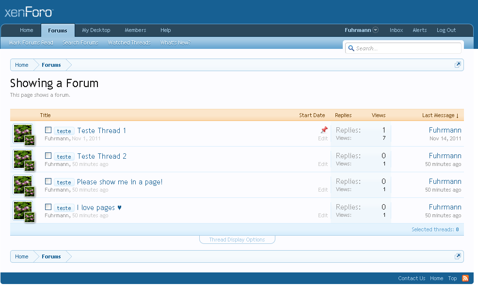
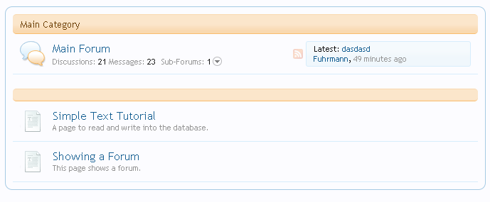

### How to show a forum in a page
###### 2011-12-08 11:12

This tutorial will explain how to show a forum (thread list) inside a page. I'll not explain why this, or why that, but all the code necessary is commented.

And this is the final result:



### Step 1 - Creating the code

The following code will be responsable for making a request to an action of the controller called `XenForo_ControllerPublic_Forum`. This action is the `actionIndex` and you can take a look at it and see what it does opening the file `library/XenForo/ControllerPublic/Forum.php` and going to the function `actionIndex`.

The action get a list of threads in a specific forum, and do others things like checking permissions, ordering threads and etc.

Create a new file inside `your_forum_root/library` and name it as `ShowAForum.php`.

Open this file and paste the following code:

```php
<?php
class ShowAForum
{
    public static function showAForumInPage(XenForo_ControllerPublic_Abstract $controller, XenForo_ControllerResponse_Abstract &$response)
    {
        /* Get the visitor param */
        $visitor = XenForo_Visitor::getInstance();

        /* Create a new request */
        $request = new Zend_Controller_Request_Http();

        /* The ID of the forum to show. In this example, we'll show the forum with the ID 2*/
        $request->setParam('node_id', 2);

        /* Create a new response */
        $responseForum = new Zend_Controller_Response_Http();

        /* New RouteMatch to use when instance the new ControllerPublic */
        $routeMatch = new XenForo_RouteMatch();

        /* The controller that holds the action that we want to call: XenForo_ControllerPublic_Forum */
        $controllerForum = new XenForo_ControllerPublic_Forum($request, $responseForum, $routeMatch);

        /* Pre Dispatch the controller with the actionIndex */
        $controllerForum->preDispatch('forum', get_class($controllerForum));

        /* Call the actionIndex in the Controller. This action show a list of threads. (that's what we want) */
        $controllerResponse = $controllerForum->{'actionForum'}();

        /* Set the param called 'visitor' in the controller response. This param is used in the thread_list template. */
        $controllerResponse->params['visitor'] = $visitor->toArray();

        /*
            Limit the numbers of thread. In this example we set to onyl show 4 threads: 0,1,2,3,4
            The actionIndex in the XenForo_ControllerPublic_Forum will get all threads, but now we can limit
        */
        $threadsToShow = 4;
        $controllerResponse->params['threads'] = array_slice($controllerResponse->params['threads'], 0, $threadsToShow - 1);

        /* Unset the param 'totalThreads' so the numbers of totalThreads will not show in the template */
        unset($controllerResponse->params['totalThreads']);

        /* Create the template to show the threads, with all the params requireds */
        $threadList = new XenForo_Template_Public('thread_list', $controllerResponse->params);

        /* Set the param 'forum' with the rendered template so we can use in our page */
        $response->params['forum'] = $threadList;

        /* return the original response to the page, with the new param 'forum' */
        return $response;
    }
}
?>
```

Simple! But what it does? Well, I'll try to explain:

This function `showAForumInPage` uses two parameters: $controller (the controller of our page) and $response (the response of our page). We'll be using just the $response, to set a custom parameter. But how to get a list of threads?

Since XenForo already do that (you can see that visiting any forum, you'll get a list of threads), we'll just call to the existing controller and action to get all the threads that we want to display. After that we just set the numbers of threads that we want to show (if we want to limit) and set others things like not showing the total numbers of threads in the template (XenForo does that in the thread_list template).

We set which forum we want to show using this piece of code:

```php
$request->setParam('node_id', 2);
```

The number 2 is the ID of the forum. Save the file.

### Step 2 - Create the page

To create a new page go to **AdminCP -> Applications -> Node Tree -> Create New Page**. Fill with this informations (or anything you want. The items with red is required to be exactly the same as I wrote in here, so this tutorial will work for you):

- **Tab** - Basic Information
- **URL Portion**: showsaforum
- **Title**: Showing a Forum
- **Description**: This page shows a forum.
- **Parent Node**: (root node)
- **Display Order**: 1
- **Display in the node list**: 1
- **Override user style choice**: Unchecked

*Tab - Page options*

- **Template HTML**:

```html
<xen:require css="discussion_list.css" />
<div class="discussionList">
    {xen:raw $forum}
</div>
```

Explaining: You'll maybe do not understand this now, but what we are doing is require the .css file for the thread listing, and inside a div we raw the parameter $forum. After calling our function we get the response and use this response to create a new template. This template will be set as the $forum paremeter.

- **Optional Components**: Do not need to check anything.

*Tab - PHP Callback*

- **PHP Callback**: ShowAForum::showAForumInPage

Save it!

### Step 3 - Testing

To test, go to your forum list and search for the recente created page. It will be there:



Click on it and the forum that you choose will be displayed on the page:


The code to call another action in another controller was made by me. This codes really works well. If anyone that knows a little more could contribute to make it better, I would really appreciate that.

### Tips:

1: You can set thread list to only display threads of a specific prefix using this:

```php
$request->setParam('prefix_id', 1);
```

Which 1 is the ID of the prefix.

2: If you only want to show sticky threads add this code:

```php
$controllerResponse->params['threads'] = array();
```

3: If you only want to show normal threads (not sticky) add this code:

```php
$controllerResponse->params['stickyThreads'] = array();
```
