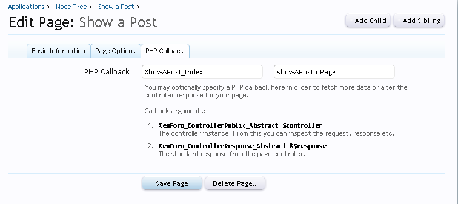
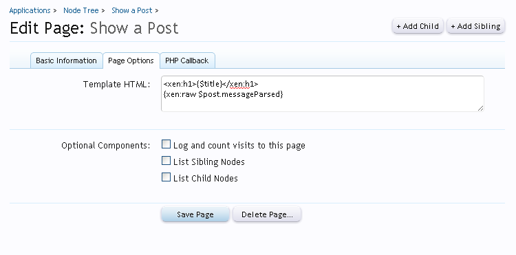
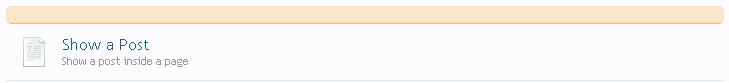
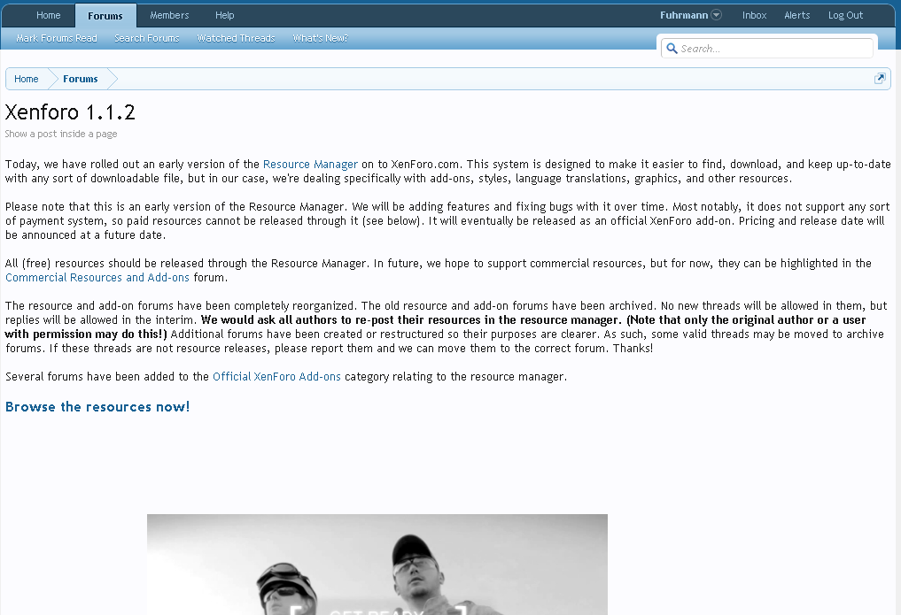

### How to show a post in a page
###### 2012-02-16 15:10

In this tutorial I will teach how to show a specific post in a XenForo page. It is also available in [here](http://xenforo.com/community/resources/how-to-show-a-post-in-a-page.306/).

<!--more-->

### Step 1 - Creating the code

Let's start by creating the code responsable to get the content of the post.

First thing you need to do is create a new file. You can place this file anywhere, but in this tutorial we will use a dedicated folder for it. Go to `your_xenforo_root/library` and create this directory structure:

```
    |-- library
    |------ ShowAPost *create this folder*
    |--------- View.php *create this file*
    |--------- Index.php *create this file*
```

The `Index.php` file will be the file that we will declare the callback class and method to our page. Copy and past the following code:

```php
<?php
/**
* How to show a post inside a page.
* This code have all the necessary to show a post inside a page. Just read the comments.
* Fuhrmann
*/

class ShowAPost_Index
{
    public static function showAPostInPage(XenForo_ControllerPublic_Abstract $controller, XenForo_ControllerResponse_Abstract &$response)
    {
        /* Set the ID of the post to be loaded */
        $postId = 180;

        /* Create a new ControllerHelper that will help us to get the post */
        $ftpHelper = new XenForo_ControllerHelper_ForumThreadPost($controller);

        /* Use the ControllerHelper to see if the post we want to get is viewable by the user browsing */
        list($post, $thread) = $ftpHelper->assertPostValidAndViewable($postId);

        /* If the post has attachments */
        if ($post['attach_count'] > 0)
        {
            /* Let's get all the attachments of this post, if exists  */
            $attachmentModel = XenForo_Model::create('XenForo_Model_Attachment');
            $attachments = $attachmentModel->getAttachmentsByContentId('post', $postId);
            foreach ($attachments AS $attachment)
            {
                /* Insert into the post data the attachments */
                $post['attachments'][$attachment['attachment_id']] = $attachmentModel->prepareAttachment($attachment);
            }
        }

        /* These parameters will be used in our template. We need to pass them into the response view. The $post param will be used too in the XenForo_ViewPublic instance */
        $viewParams = array (
            'post' => $post,
            'title' => $thread['title']
        );

        /* This way our post will be parsed and the aattachments too. :) */
        $response = $controller->responseView('ShowAPost_View', $response->params['templateTitle'], $viewParams);

        /* Return the response, finally!*/
        return $response;
    }
}
?>
```

(The code is all explaned as comments. Please take a time to read all to understand better. The advanced stuff it is not so well explaned, because the objective of this tutorial is simple)

Do not forget to change the postId to what you want:

```php
$postId = 180;
```

Save!


Now, open the `View.php` file. This file will parse all bbcode in the post message.

Copy and paste inside the file:

```php
<?php
class ShowAPost_View extends XenForo_ViewPublic_Base
{
    public function renderHtml()
    {
        /* Get the post we need to parse the content */
        $post = $this->_params['post'];

        /* Create the parser to parse the bbcodes */
        $bbCodeParser = new XenForo_BbCode_Parser(XenForo_BbCode_Formatter_Base::create('Base', array('view' => $this)));

        /* Parse options */
        $bbCodeOptions = array(
            'states' => array(
                'viewAttachments' => true //If you don't want to show attachments, set this to false
            )
        );

        /* parse the post message and merge into the post data */
        $this->_params['post']['messageParsed'] = XenForo_ViewPublic_Helper_Message::getBbCodeWrapper($post, $bbCodeParser, $bbCodeOptions);
    }
}
?>
```


### Step 2 - Creating the page

Now we'll create the page that will show the post you want to show. Go to **AdminCP -> Applications -> Create new Page**. In the next page, you have some fields to fill. Use the information below:

Basic Information:

- **URL Portion**: showapost
- **Title**: Show a Post (The title doest not matters, because we'll use the thread title)
- **Description**: Show a post inside a page
- **Basic Information**:
- **Template HTML**:<br>

```html
<xen:h1>{$title}</xen:h1>
{xen:raw $post.messageParsed}
```

- **PHP Callback**:
- **PHP Callback**: ShowAPost_Index::showAPostInPage

This is what you will have at the end:


<br>


<br>


<br>

Save the page.

### Step 3 - Testing

Now go to your forum list. You should see the page node there:



Click to enter the page and see the result. Your post is now being displayed inside a page!



### Tips

If you want to show the page title and not the thread title, just change the Template HTML of the page to this:

```html
{xen:raw $post.messageParsed}
```

If you want to hide the breadcrumbs put the following code at the TOP of the template HTML of the page:

```css
<style>
.breadcrumb {
    display:none !important;
}
</style>
```
