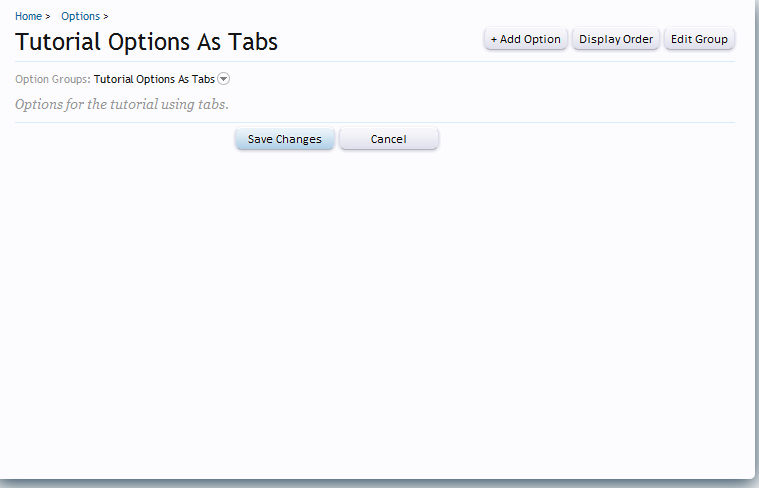
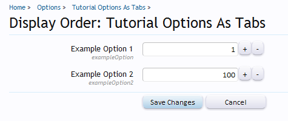
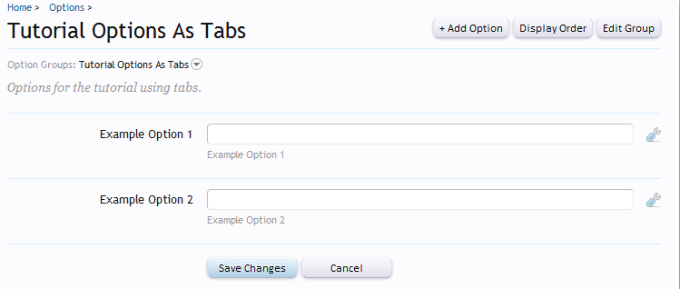
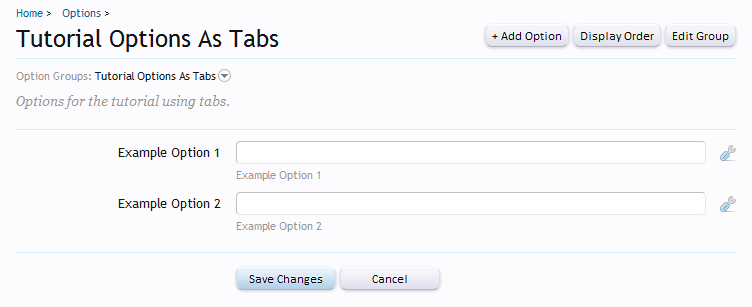
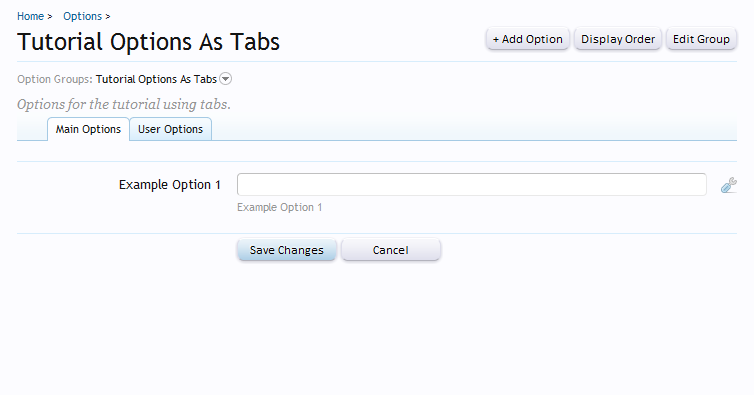
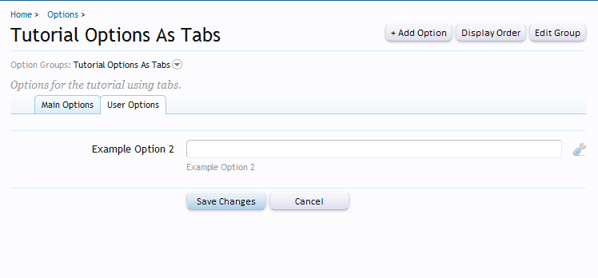

### How to use tabs to separate your add on options
###### 2012-02-12 10:59

I will teach how to tweak the add-on options page to display something like this:


## Steps

This tutorial consists in 4 steps:

- [Step 1 - Creating the Add-on](#step_1__creating_the_addon)
- [Step 2 - Creating the options](#step_2__creating_the_options)
- [Step 3 - The Template](#step_3__the_template)
- [Step 4 - The listener](#step_4__the_listener)

### <a name="step_1__creating_the_addon"></a>Step 1 - Creating the Add-on

First we need to create a new add-on. This is a very simple step. To be able to create you need to be in Debug Mode. You can see how to put your forum in Debug Mode in this [link](http://xenforo.com/community/threads/frequently-asked-questions.5183/#post-248490).

To create a new add-on go to **AdminCP -> Home -> List Add-ons** and click in the button **Create Add-on**. In the following screen you need to fill those fields to create the add-on. Use the info below:

- **Add-on ID**: OptionsAsTabs
- **Title**: Tutorial Options As Tabs
- **Add-on is active**: Checked
- **Version String**: 1.0.0
- **Version ID**: 1

And the rest of the fields just let in blank. We do not need to fill. This add-on is just simple add-on, so we dont have any installation process or something.

Click Save Add-on and your add-on is created!

Before continue, let's create our folder and the file. Go to `your_xenforo_root/library` and create a folder naming it to `OptionsAsTabs`.
Inside this new created folder, create a file called: `Listener.php`. Let the file empty, we will use it later.

### <a name="step_2__creating_the_options"></a>Step 2 - Creating the options

Now we need to create some example options so you can see what we are trying to do here. To create options, you need a group options first. Go to **AdminCP -> Home -> Options** and click in the button **+Add Options Group**.

In the next page use the information below to fill the required fields:

- **Group ID**: OptionsAsTabs
- **Title**: Tutorial Options As Tabs
- **Description**: Options for the tutorial using tabs.
- **Display Order**: 1
- **Display this group in debug mode only**: not checked
- **Add-on**: Tutorial Options As Tabs

Click in the **Save Option Group** button.

You will end up with this:



Now, we will create 2 options to use as example. Click in the button + Add Option and use the information bellow to fill the fields:

*values in red are important, don't forget to use exactly as is in here.*

#### Option 1

- **Option ID**: exampleOption
- **Add-on**: Tutorial Options As Tabs
- **Title**: Example Option 1
- **Explanation**: Example Option 1
- **Edit Format**: Text Box
- **Data Type**: String
- ... some other fields in the middle, just let they in blank ...
- **<span style="color:red">Display Order</span>**: Tutorial Options As Tabs: Checked, value = 1

#### Option 2

- **Option ID**: exampleOption2
- **Add-on**: Tutorial Options As Tabs
- **Title**: Example Option 2
- **Explanation**: Example Option 2
- **Edit Format**: Text Box
- **Data Type**: String
- ... some other fields in the middle, just let they in blank ...
- **<span style="color:red">Display Order</span>**: Tutorial Options As Tabs: Checked, value = 100

Explanation of the display order difference :



You may ask:
> "Why we put the display order of the first option to 1 and the second to 100?".
With a 100 value difference XenForo always inserts a "line" to separate our options. You can take a look at our example:




Try to change the display order and set the two display order of our options to 1 each one. You will end up with this:




So, with this, we can say that each option that has the display order difference of 100 will appear in another tab. It will be something like this:

- Tab 1

    - Option 1 - this option has the display order of 1

- Tab 2

    - Option 2 - this option has the display order of 100. (Dont forget to change back the display order of the option 1 to 1 and option 2 to 100)

### <a name="step_3__the_template"></a>Step 3 - The Template

Ok, now we need to discover which template XenForo uses in the options page.
Since we are in the AdminCP, we need to go to **AdminCP -> Development -> Admin Templates**. There, you should search for **option_list** template. This is the template used to list options for each add-on.

Next, copy all the template into a editor and let's do our modifications.

With the editor open find this piece of code:

```html
<xen:if hascontent="true"><div class="optionGroupDescription muted"><i><xen:contentcheck>{xen:raw $group.description}</xen:contentcheck></i></div></xen:if>
```

Right below insert this:

```html
<ul class="tabs mainTabs Tabs" data-panes="#OptionPanes > li" data-history="on">
    <li><a href="{$requestPaths.requestUri}#1">Main Options</a></li>
    <li><a href="{$requestPaths.requestUri}#2">User Options</a></li>
</ul>
```

Explanation:

- **#OptionPanes**: This is the unique indentifier of all our tabs.
- **#1, #2**: Each tab must have a unique indentifier too. So, in this case we use numbers.

Ok, we just have added our tabs. But the tabs will not work if we dont wrap the content of the options into the proper html.

Now, find this:

```html
<xen:foreach loop="$renderedOptions" value="$_group">
```


Right above, insert this:

```html
<ul id="OptionPanes">
```


OptionPanes - Remember? The unique indentifier of all our tabs.

Now, find this:

```html
<xen:submitunit save="{xen:phrase save_changes}">
```

And right above inser this:

```html
</ul>
```

This closes the contents of our tabs. SO, now we have wrapped all the options into the proper html tags to make the tabs works. But we have one thing to do yet in this template.

Find this:

```html
<fieldset class="optionList">
```

Above, insert this:

```html
<li id="{$i}" class="profileContent">
```

Dont worry about the {$i} variable. I'll explain later.

Search this:

```html
</fieldset>
```

Below insert this:

```html
</li>
```

With this we are wrapping each group options (remember, the 100 difference value) into a `<li>` tag with the respective indentifier. But wait. The unique identifier of each tab is #1 and #2. How it will work?

Well, we have another thing to do:

Search this:

```html
<xen:foreach loop="$_group" key="$optionId" value="$renderedOption">{xen:raw $renderedOption}</xen:foreach>
```

And above inser this:

```html
<xen:set var="$i">{xen:calc '{$i} + 1'}</xen:set>
```

The {$i} variable, remember? So, this will be used to specific the identifier of each tab.

Since we have two tabs #1 and 2#, we have to find a way to set a unique indentifier in the foreach routine. That way, every time the foreach complete the routine it will add +1 to $i variable.

We will end up with this:

```html
<li id="#1" class="profileContent">EXAMPLE OPTION 1<li>
<li id="#2" class="profileContent">EXAMPLE OPTION 1<li>
```

That's all to finish our template. Now, you need to create it in the admin templates section. **AdminCP -> Development -> Admin Templates** and click in the **+Create Admin Template** button:

- **Template Name**: OptionsAsTabs
- **Content**: The content of your template. Just in case, I'll put here:

```html
<xen:title>{xen:phrase options}: {$group.title}</xen:title>
<xen:h1>{$group.title}</xen:h1>
<xen:container var="$head.optionCss">
    <style>
    .hiddenOption  { display: inline-block; font-size: 9px; margin-right: 3px; color: @mutedTextColor; }
    .hiddenOption a { position: static; }
    .optionList a.optionAnchor { position: absolute; top: -80px; } /* prevents anchors pointing going under the fixed header */
    </style>
</xen:container>

<xen:if is="{$canEditGroup}">
    <xen:topctrl>
        <a href="{xen:adminlink 'options/add-option', '', "group_id={$group.group_id}"}" class="button">+ {xen:phrase add_option}</a>
        <a class="button" href="{xen:adminlink 'options/display-order', $group}">{xen:phrase display_order}</a>
        <a class="button" href="{xen:adminlink 'options/edit-group', $group}">{xen:phrase edit_group}</a>
    </xen:topctrl>
</xen:if>

<xen:form action="{xen:adminlink 'options/save', $group}">
    <div class="topChoosers">
        <div class="Popup">
            <span class="muted">{xen:phrase option_groups}:</span> <a rel="Menu">{$group.title}</a>
            <div class="Menu">
                <div class="primaryContent menuHeader"><h3>{xen:phrase option_groups}</h3></div>
                <ul class="secondaryContent blockLinksList">
                    <xen:foreach loop="$groups" value="$_group">
                        <li><a href="{xen:adminlink 'options/list', $_group}">{$_group.title}</a></li>
                    </xen:foreach>
                </ul>
            </div>
        </div>
    </div>
    <xen:if hascontent="true"><div class="optionGroupDescription muted"><i><xen:contentcheck>{xen:raw $group.description}</xen:contentcheck></i></div></xen:if>
    <ul class="tabs mainTabs Tabs" data-panes="#OptionPanes > li" data-history="on">
        <li><a href="{$requestPaths.requestUri}#1">Main Options</a></li>
        <li><a href="{$requestPaths.requestUri}#2">User Options</a></li>
    </ul>
    <ul id="OptionPanes">
        <xen:foreach loop="$renderedOptions" value="$_group">
            <xen:if hascontent="true">
                <li id="{$i}" class="profileContent">
                    <fieldset class="optionList">
                        <xen:contentcheck>
                            <xen:set var="$i">{xen:calc '{$i} + 1'}</xen:set>
                            <xen:foreach loop="$_group" key="$optionId" value="$renderedOption">{xen:raw $renderedOption}</xen:foreach>
                        </xen:contentcheck>
                    </fieldset>
                </li>
            </xen:if>
        </xen:foreach>
    </ul>

    <xen:submitunit save="{xen:phrase save_changes}">
        <input type="reset" class="button" value="{xen:phrase cancel}" accesskey="r" />
    </xen:submitunit>
</xen:form>
```

Save the template and the template is ready.

### <a name="step_4__the_listener"></a>Step 4 - The listener

Remember in the begining the `Listener.php` file? So, go there and open the file.

Put this:

```php
<?php
class OptionsAsTabs_Listener
{
    /***
    * This is the event listener callback. All the params are explanaded in the Code Event Listener page in the AdminCP.
    */
    public static function templatePostRender($templateName, &$content, array &$containerData, XenForo_Template_Abstract $template)
    {
        /* If the template is the one we want to change */
        if ($templateName == 'option_list')
        {
            /* If we are viewing our addon options page */
            if ($containerData['title'] == 'Options: Tutorial Options As Tabs')
            {
                /* Change the default options list template to our new one */
                $content = $template->create('OptionsAsTabs', $template->getParams());
            }
        }
    }
}
?>
```

Save it!

Now to make things finally work, we need to create the listener. Go to **AdminCP -> Development -> Code Event Listeners** and click in the button **+Create New Code Event Listener**.

- **Listen to event**: template_post_render
- **Execute CallBack**: OptionsAsTabs_Listener::templatePostRender
- **Callback Execution Order**: 10
- **Enable Callback Execution**: checked
- **Description**: Options as Tabs
- **Add-on**: Tutorial Options as Tabs

Save the event listener.


Go to **AdminCP -> Options -> Tutorial Options As Tabs** and you will see the result:

#### Main Options



#### User Options



That's it!
